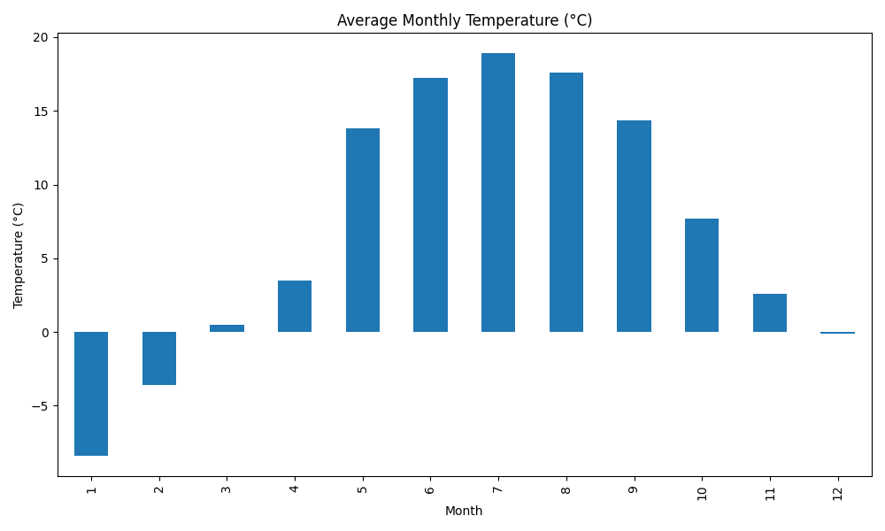

## CI Workflow

Climate Insights is a startup company that analyzes historical temperature data to visualize monthly trends.
The data team needs an automated CI pipeline to:

- Ensure the analysis script is correct
- Follow code style guidelines
- Automatically generate updated visualizations
- Store these visualizations as CI artifacts

They have a functional Python script that utilizes these technologies:
- [pandas](https://pypi.org/project/pandas/): A Python library for data manipulation and analysis, especially useful for working with structured data like tables and spreadsheets.
- [matplotlib](https://pypi.org/project/matplotlib/): A widely-used Python library for creating static, animated, and interactive data visualizations (often used for plotting graphs and charts).
- [pytest](https://pypi.org/project/pytest/): A testing framework for Python, making it easy to write simple and scalable test cases for your code.
- [flake8](https://pypi.org/project/flake8/): A tool for checking the style and quality of Python code, helping developers follow best practices and identify errors or formatting issue

Python script `src/anayze.py`:
-  Loads the data/helsinki2024.csv file (daily temperature data).
- Calculates the average temperature per month.
- Draws a chart and saves it to the file.

> NOTE
> 
> For this assignment, Python coding skills are not required. If you encounter linting errors, carefully review the logs and follow the instructions provided

Your mission, if you choose to accept it, is to build and test this automation pipeline using GitHub Actions. It may be a good idea to first experiment with the commands and run them either locally or in a Docker container to understand how everything works. Once you are familiar with the commands, you can proceed to implement the CI pipeline.

## Steps

Your goal is to complete the GitHub Actions workflow file ([`.github/workflows/ci.yml`](./.github/workflows/ci.yml)) by implementing the following steps.

#### Step 1 Define Workflow Triggers
- Make the workflow run when code is **pushed** or a **pull request** is made to the **main** branch.

💡 Hint: Use on: with common GitHub events like push and pull_request.

#### Step 2 Set the Runner Environment
- Specify that the workflow should use a Linux-based virtual environment.

💡 Hint: Use the latest Ubuntu runner.

#### Step 3 **Checkout the Code**
- Include a step to make the code from your repository available in the workflow.

💡 Hint: Use an official GitHub-provided action for this.

#### Step 4 **Set Up Python**
- Configure the Python version used in the workflow.

💡 Hint: Use an action that lets you choose the Python version (e.g., 3.11).

#### Step 5 **Install Dependencies** 
- Install all Python libraries listed in `requirements.txt` file.

💡 Hint: Use pip with the provided `requirements.txt` file. The command is `pip install -r <file_name>`

#### Step 6 **Lint the Code**
- Add a step to check code style for both `source` and `test` directories. Fix linter errors if there are any.

💡 Hint: Use flake8 to check src/ and tests/ folders. The command is `flake8 <folder_1> <folder_2>`.
💡 Hint: flake8 was installed earlier with the [requirements.txt](./requirements.txt) file.

#### Step 9 **Run Tests**
- Run automated tests to verify your script works correctly.

💡 Hint: Use the `pytest` test framework that was installed earlier with the [requirements.txt](./requirements.txt) file. The command to run tests is `pytest tests/ --verbose`.
💡 Hint: Set an environment variable `PYTHONPATH` and set its value `${{ github.workspace }}` so the test runner can find the src/ folder.

#### Step 8 **Generate the Plot**
- Run the analysis script that reads a CSV file and outputs a plot.

💡 Hint: The script accepts input and output paths as arguments. The command is `python src/analyze.py <input_csv> <output_file>`. The csv file that contains data can be found from the [`data` directory](./data/). The output file name should be `plot.png` and located in the `output` directory.

#### Step 9 **Upload the Plot**
- Make the generated plot available as a downloadable artifact in GitHub Actions.

💡 Hint: Use the official upload-artifact action and use the following values `Name: climate-plot` and `Path: output/plot.png`

## Result

After the succesfull workflow run open the workflow log in Github and open `Upload Plot Artifact` step. You can find link to download plot from the log. Download the plot file and it should look the following:

### Bonus Step: Publish Plot as GitHub Pages

Automatically deploy the plot to GitHub Pages on push to main.
Add a step to CI that:
- Downloads artifact output/plot.png (you can use action `download-artifact`)
- Publish plot (you can use `peaceiris/actions-gh-pages` action)

## About the exercise
This exercise has been created by Juha Hinkula and is licensed under the Creative Commons BY-NC-SA license.

The weather data used in this exercise has been downloaded from [the Finnish Meteorological Institute](https://ilmatieteenlaitos.fi/) using their [Download observations service](https://www.ilmatieteenlaitos.fi/havaintojen-lataus). The data is licensed under their [open data license](https://www.ilmatieteenlaitos.fi/avoin-data-lisenssi).

AI tools such as ChatGPT and GitHub Copilot have been used in the implementation of the task description, source code, data files and tests.
